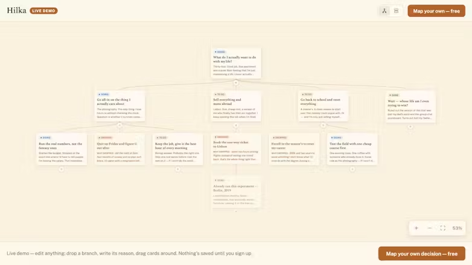
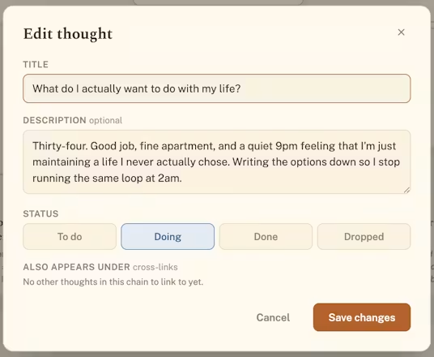
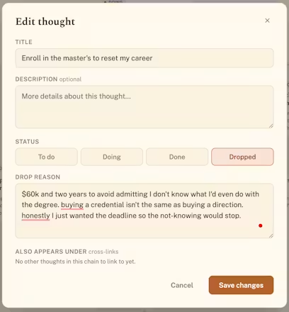

# 🌳 Hilka

**Log how you think, not just what you decided.**

A free, open-source decision-tree journal. Map a question as a tree of one-idea-per-card
thoughts — and the branches you reject stay forever, **with the reason you killed them.**
Build it by hand, or let your AI assistant build it for you.

[**Open the app →**](https://hilka.pages.dev) · [Two ways to use](#two-ways-to-use-hilka) · [How it works](#how-it-works)

React 19 · TypeScript · Supabase · Cloudflare — *Hilka* (гілка) = branch.

Most notes capture conclusions. Hilka captures the **reasoning** — including the branches you
rejected, which is usually where the real thinking lives. Months later you re-read not just
*what* you chose, but *why* the alternatives didn't survive.

- 🪦 **Rejected branches are first-class** — dropping one demands a written reason; it stays on the canvas with that reason instead of vanishing.
- 🗺️ **Two views of one tree** — a pan/zoom **canvas** of cards on curved branches, or a linear **chain** feed.
- 🚦 **A progress axis** — every thought is `todo · doing · done · dropped`.
- 📱 **Phone & tablet ready** — touch drag, pinch-zoom, bottom-sheet editing.
- 🎨 **Two themes** — Ink and Warm.
- 💾 **Yours to keep** — one-click Markdown / JSON export, free, open source.

---

## Two ways to use Hilka

Hilka started as a canvas you build by hand. It now *also* lets any AI assistant build the
tree for you. **Both are first-class and both are free** — use whichever fits how you think.

<table>
<tr>
<td width="50%" valign="top">

### ✍️ Build it by hand

The original idea. Map a question as a tree of one-idea cards on a pan/zoom **canvas** (or a
linear **chain** feed). Branch into every option you're weighing; drag cards to reparent or
reorder. When you kill a branch, Hilka makes you write *why* before it lets you drop it — and
the dead end stays, greyed-out with its reason, so nothing is ever lost.

No setup, no account linking — just open it and start thinking.

**→ [Open the canvas](https://hilka.pages.dev)** and start your first chain.

<!-- TODO: mini-GIF — building a tree by hand on the canvas. -->

</td>
<td width="50%" valign="top">

### 🤖 Create it from your AI assistant

Mid-reasoning with **Claude, ChatGPT, Codex, or Cursor**, just say:

> *"make me a Hilka chain about whether to switch jobs"* — or — *"save this reasoning as a Hilka chain"*

The assistant designs the tree — the branches, the dead-ends it ruled out and *why* — and
writes it straight into **your** Hilka account over a small **[MCP server](#connect-your-assistant)**.
Everything it creates is scoped to you.

**→ [Connect your assistant](#connect-your-assistant)** once, then create chains by asking.

<!-- TODO: mini-GIF — asking an AI to map a decision; the chain appears in Hilka. -->

</td>
</tr>
</table>

### Connect your assistant

Open your Hilka → **Settings → Connect your AI assistant** to see your personal server URL,
then pick one (most → least convenient):

- **OAuth (no token):** add the MCP server URL to your assistant and log in when prompted —
  `https://hilka-mcp.sviatik2408.workers.dev/mcp`
- **Claude plugin:** `/plugin marketplace add Sviat838/Hilka-` then `/plugin install hilka@hilka`
- **Token (fallback):** generate one in that screen and paste it as an `Authorization: Bearer` header.

Architecture and setup of the MCP server live in [`worker/`](worker/).

<b>Why this matters (the longer version)</b>

 

Hilka borrows from habits good decision-makers have used for decades:

- **Decision journaling** — write down a choice and its reasoning *at the time*, so you can
  learn from it later instead of rewriting history.
- **Issue / logic trees** — break a fuzzy question into branches you can reason about one at
  a time (the way consultants and engineers decompose problems).
- **Mind mapping** — think on a canvas, not in a wall of text.

This matters more, not less, in the age of AI:

> **You can outsource your thinking, but you can't outsource your understanding.**

Let an assistant draft, code, and explore for you — but the understanding still has to live
somewhere. Hilka is where you keep it: your reasoning, externalized, branchable, and yours.
That's also why the AI path *writes into your tree* rather than thinking for you — the
artifact is yours to keep, revisit, and prune.

## How it works

A **chain** is a tree you view two ways: a pan/zoom **canvas** of cards on curved branches,
or a linear **chain** feed. Each thought has a status — `todo · doing · done · dropped` —
and two rules the app enforces hard:

- **Dropping a branch demands a written reason** (the UI blocks save; a DB check backs it up).
- **Dropped branches can't grow children and can't be deleted** unless they're leaves —
  dropping is the soft-delete; delete is for typos. Reopening a dropped thought keeps its old
  reason, so nothing is ever lost.

Drag a card to reparent or reorder it; cycles and attaching to a dropped branch are blocked
both in the UI and by a DB trigger. Two themes (Ink and Warm). Works on phones
and tablets (touch drag, pinch-zoom, bottom-sheet editing).

<table>
<tr>
<td width="50%" valign="top"></td>
<td width="50%" valign="top"></td>
</tr>
</table>

## License

[MIT](LICENSE) © Sviat Nahirnyi. Free to use, fork, and build on.
